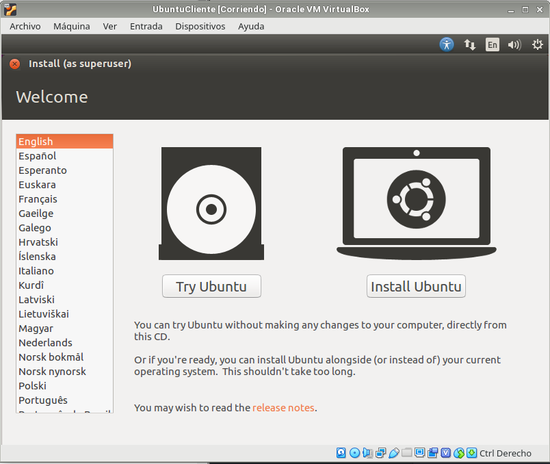
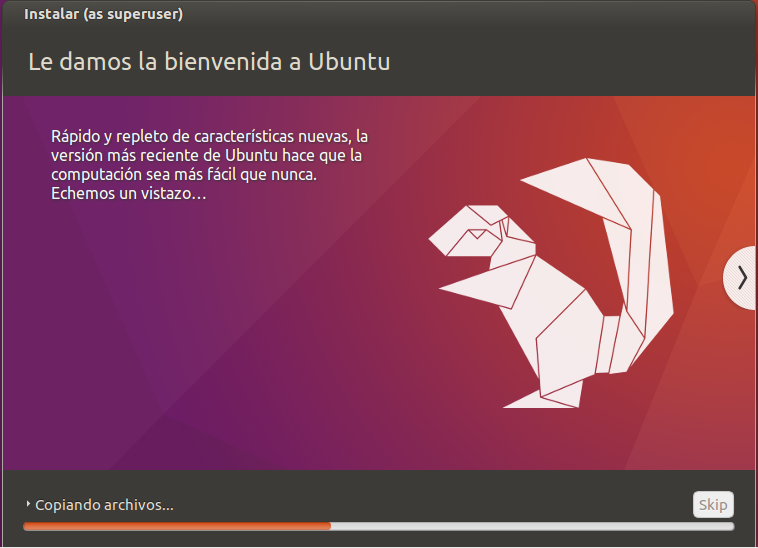

# Instalaciones y configuraciones previas

---

## 1. Ubuntu 16 Cliente

### 1.1. Instalación

Para comenzar, empezamos con Ubuntu 16.

Ponemos la configuración predeterminada e instalamos.

### 1.2. Funcionamiento

---

## 2. Ubuntu 16 Servidor

### 2.1. Instalación

### 2.2. Funcionamiento

---

## 3. Windows 7

---

## 4. Windows 2016 Server

