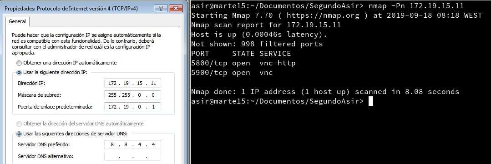

# Acceso remoto VNC

---

> * Vamos a realizar las siguientes conexiones remotas VNC:
>   * Acceder a Windows - desde Windows 7/10.
>   * Acceder a Windows - desde GNU/Linux OpenSUSE.
>   * Acceder a GNU/Linux OpenSUSE - desde GNU/Linux OpenSUSE (A lo mejor no hay que instalar el software cliente VNC)
Acceder a GNU/Linux OpenSUSE - desde Windows 7/10.

## 1. Instalación en Windows

### 1.1. Ir al servidor VNC en Windows

Descargamos `TightVNC`

Utilizaremos la versión `Custom` y en concreto la `TightVNC Server`. Esto es el servicio.

> Revisamos la configuración del cortafuegos del servidor VNC Windows para permitir VNC.

### 1.2. Ir a la máquina GNU/Linux

* Ejecutamos `nmap -Pn 172.19.15.11` (esta sería mi IP del VNC Server), desde la máquina real GNU/Linux para comprobar que los servicios son visibles desde fuera de la máquina VNC-SERVER.
*Deben verse los puertos 580X, 590X, etc.*

### 1.3. Ir al cliente Windows

En el cliente Windows instalaremos `TightVNC`.

Usaremos `TightVNC Viewer`. Esto es el cliente VNC.

### 1.4. Comprobaciones finales

Probamos desde el `VNC Server` la conexión con el `VNC Cliente`.

Para verificar que se han establecido las conexiones remotas, vamos al servidor VNC y usamos el comando `netstat -n` para ver las conexiones VNC con el cliente.

---

## 2. Instalación en OpenSUSE

### 2.1. Ir al servidor VNC OpenSUSE

### 2.2. Ir a la máquina GNU/linux

### 2.3. Ir al cliente GNU/linux

### 2.4. Comprobaciones finales

---

## 3. Comprobaciones con SSOO cruzados

---

## 4. DISPLAY 0 en GNU/Linux

