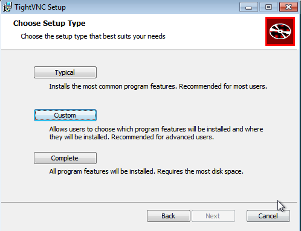
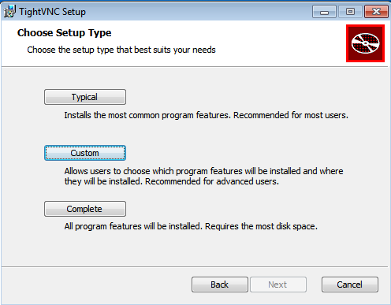
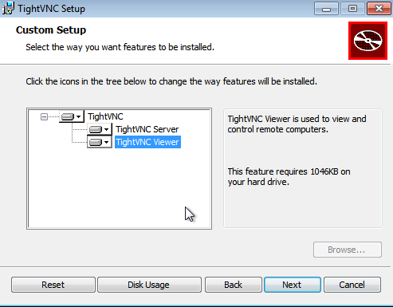
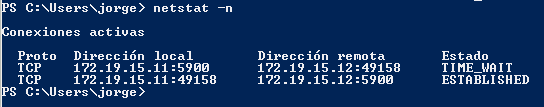

# Acceso remoto VNC

---

## Introducción VNC

> * Vamos a realizar las siguientes conexiones remotas VNC:
>   * Acceder a Windows - desde Windows 7.
>   * Acceder a Windows - desde GNU/Linux OpenSUSE.
>   * Acceder a GNU/Linux OpenSUSE - desde GNU/Linux OpenSUSE
Acceder a GNU/Linux OpenSUSE - desde Windows 7.

| MV | OS       | IP           | Rol        | Detalles              |
| :-: | :-------: | ------------ | ---------- | --------------------- |
|  1 | Windows  | 172.AA.XX.11 | Slave VNC  | Instalar servidor VNC |
|  2 | Windows  | 172.AA.XX.12 | Master VNC | Instalar cliente VNC  |
|  3 | OpenSUSE | 172.AA.XX.31 | Slave VNC  | Instalar servidor VNC |
|  4 | OpenSUSE | 172.AA.XX.32 | Master VNC | Instalar cliente VNC  |

---

## 1. Windows: Slave VNC

### 1.1. VNC Server

Descargamos `TightVNC`

Utilizaremos la versión `Custom` y en concreto la `TightVNC Server`. Esto es el servicio.

> Revisamos la configuración del cortafuegos del servidor VNC Windows para permitir VNC.

### 1.2. Ir a la máquina GNU/Linux (Real)

* Ejecutamos `nmap -Pn 172.19.15.11` (esta sería mi IP del VNC Server), desde la máquina real GNU/Linux para comprobar que los servicios son visibles desde fuera de la máquina VNC-SERVER.
*Deben verse los puertos 580X, 590X, etc.*

---

## 2. Windows: Master VNC

### 2.1. VNC Viewer

En el cliente Windows instalaremos `TightVNC`.

Usaremos `TightVNC Viewer`. Esto es el cliente VNC.

### 2.2. Comprobaciones finales

Probamos desde el `VNC Cliente` la conexión con el `VNC Server`.

Para verificar que se han establecido las conexiones remotas, vamos al servidor VNC y usamos el comando `netstat -n` para ver las conexiones VNC con el cliente.

---

## 3. OpenSUSE: Slave VNC

### 3.1. VNC Server

### 3.2. Ir a la máquina GNU/linux

---

## 4. OpenSUSE: Master VNC

### 4.1. VNC Viewer

### 4.2. Comprobaciones finales

---

## 5. Comprobaciones con SSOO cruzados

---

## 6. DISPLAY 0 en GNU/Linux

