# OpenVPN

---

## 1. Configuración - Panel de Control PFsense

### 1.1. Certificate Manager

En el apartado `CAs` añadimos un certificado con las siguientes características.

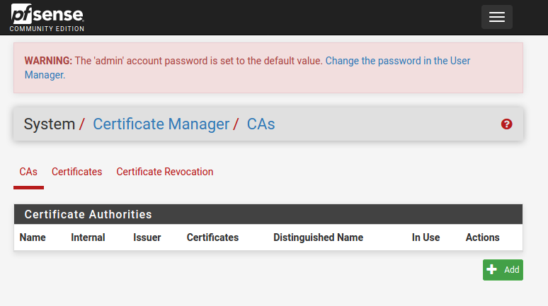

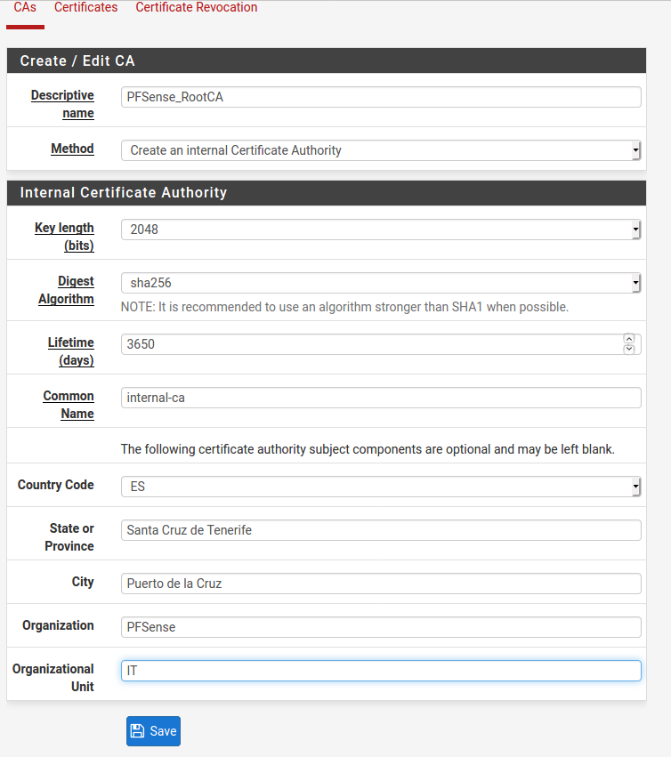

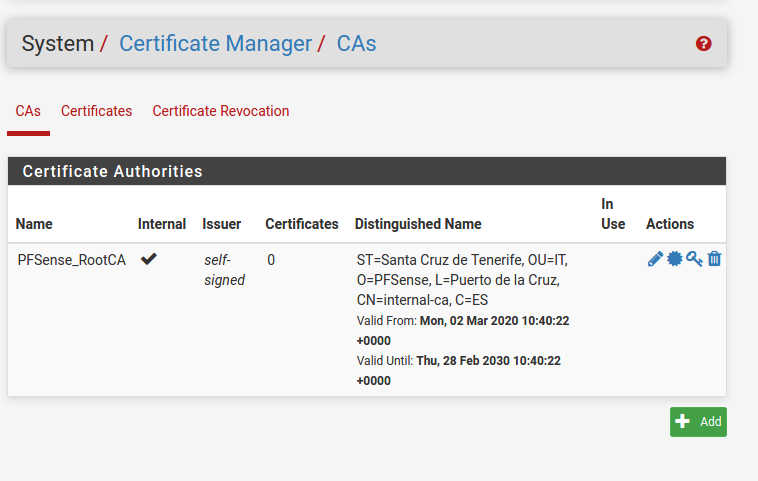

Ahora vamos al apartado `Certificates` y lo rellenamos de la siguiente forma:

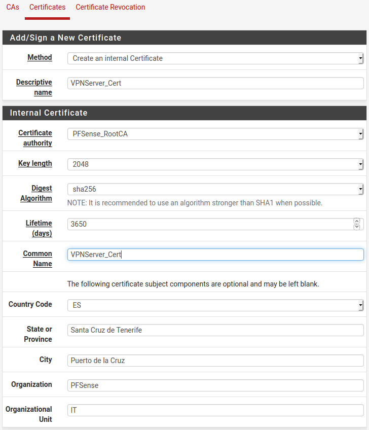

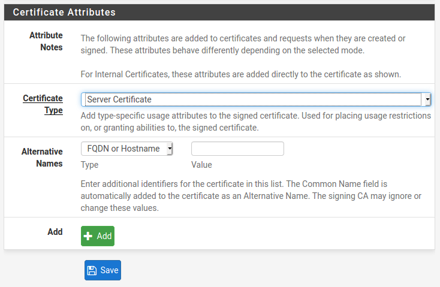

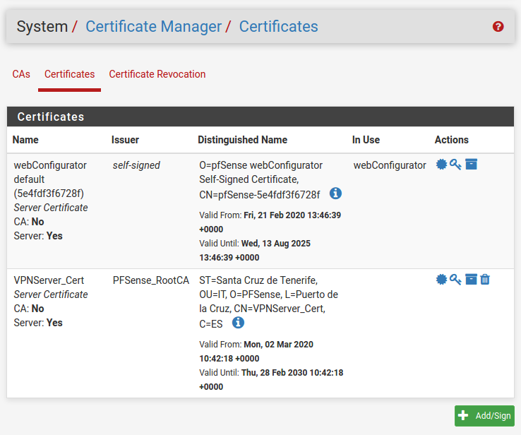

### 1.2. Wizards

**Type of Server:** `Local User Access`

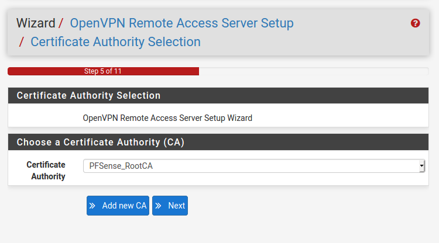

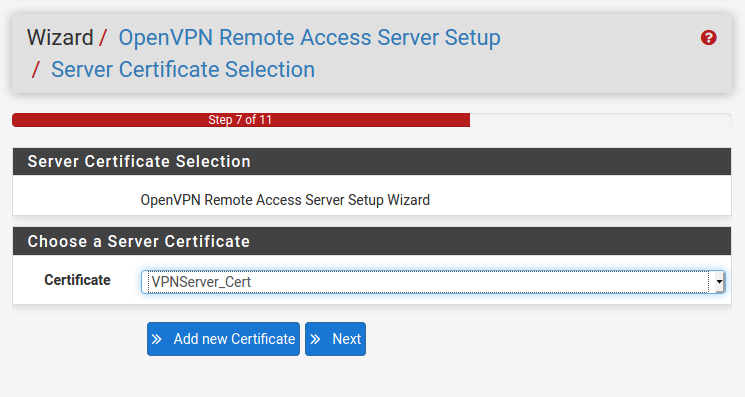

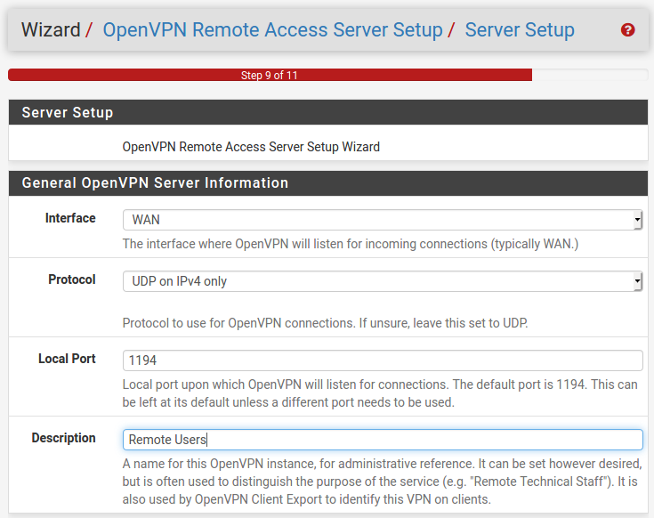

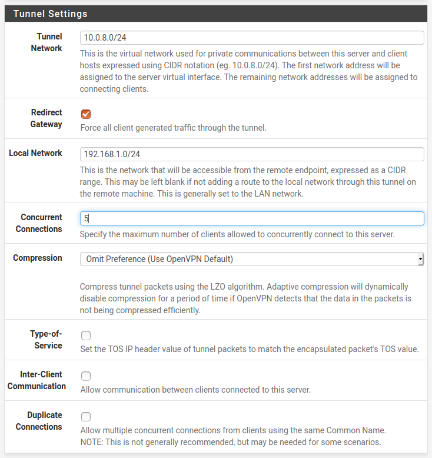

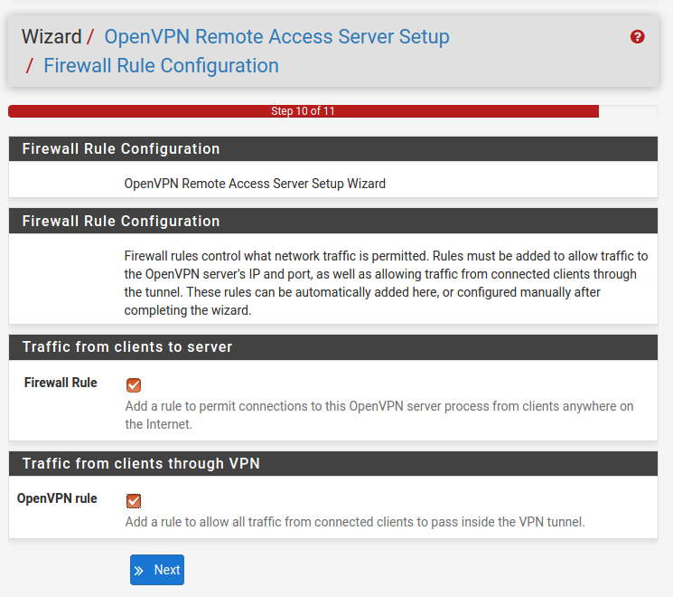

### 1.3. OpenVPN

En el apartado `Servers` comprobamos que se ha creado correctamente.

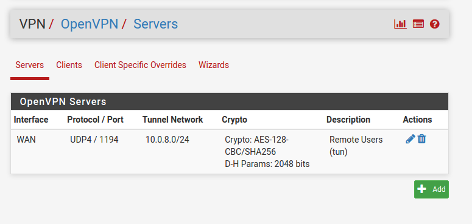

Y ahora creamos un cliente en el apartado `Clients`.

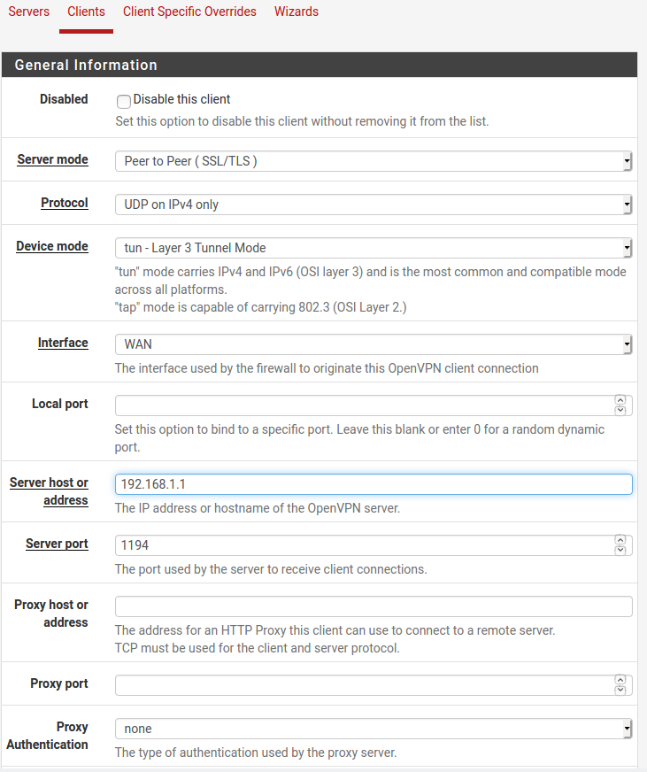

