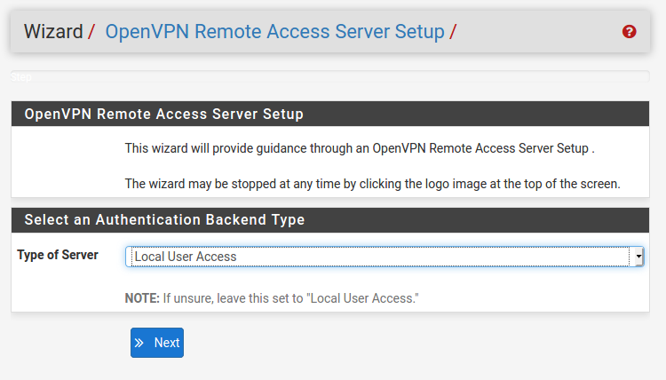

# OpenVPN

---

## 1. Configuración - Panel de Control PFsense

### 1.1. Certificate Manager

En el apartado `CAs` añadimos un certificado con las siguientes características.

Ahora vamos al apartado `Certificates` y lo rellenamos de la siguiente forma:

### 1.2. Wizards

**Type of Server:** `Local User Access`

### 1.3. OpenVPN

En el apartado `Servers` comprobamos que se ha creado correctamente.

Y ahora creamos un cliente en el apartado `Clients`.

### 1.4. Package Manager

En el apartado `Available Packages` buscamos el paquete ***openvpn-client-export*** y lo instalamos.

---

## 2. Comprobación

Comprobamos con el comando `tracert 8.8.8.8`.

