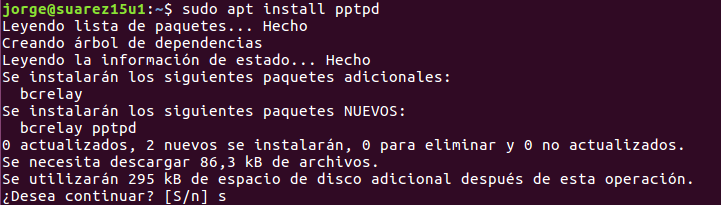
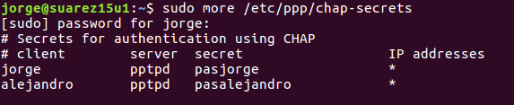
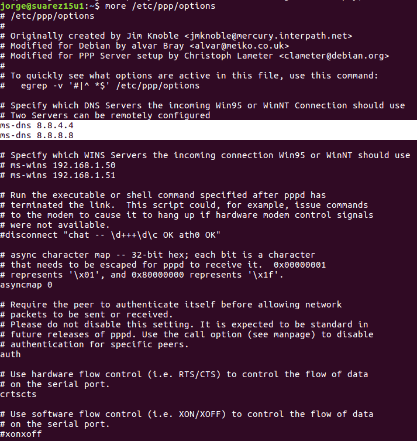
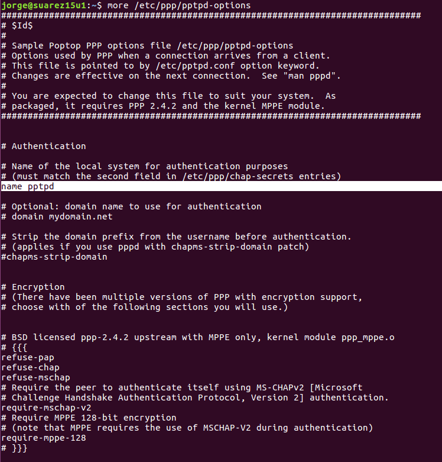
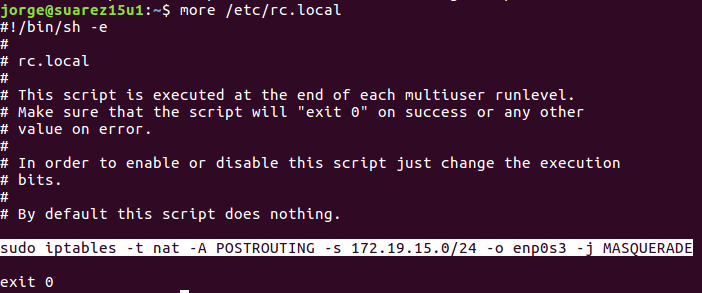
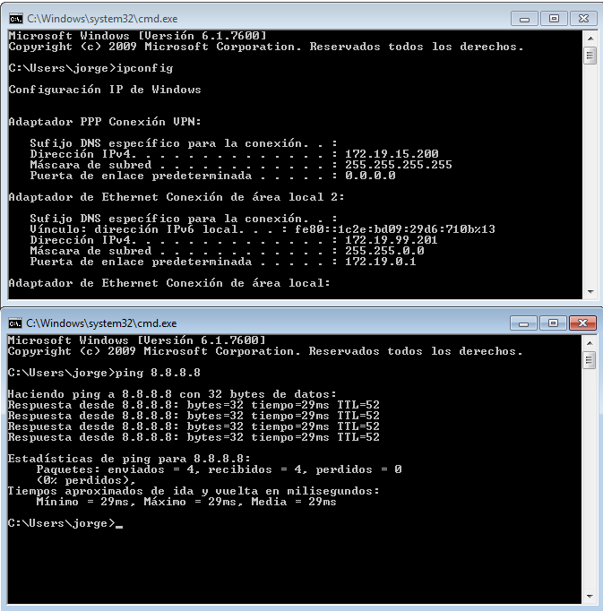

# VPN en Linux con PPTP

---

## Configuración IP estática

Comenzamos poniendo la IP estática en fichero `/etc/network/interfaces`.

## Instalando PPTP

Para instalarlo, lo hacemos con **zypper**.

## Configuración

Ahora modificaremos 5 ficheros:
* /etc/ppp/chap-secrets

* /etc/ppp/options

* /etc/ppp/pptpd-options

* /etc/pptpd.config

* /etc/rc.local

## Comprobación

