# Proxy

---

## 1. Configuración

### 1.1. Package Manager

Primero buscaremos e instalaremos `squid`.

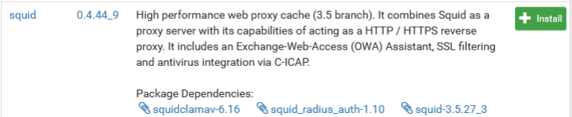

### 1.2. Squid Proxy Server

En el apartado `Local Cache` modificamos lo siguiente:

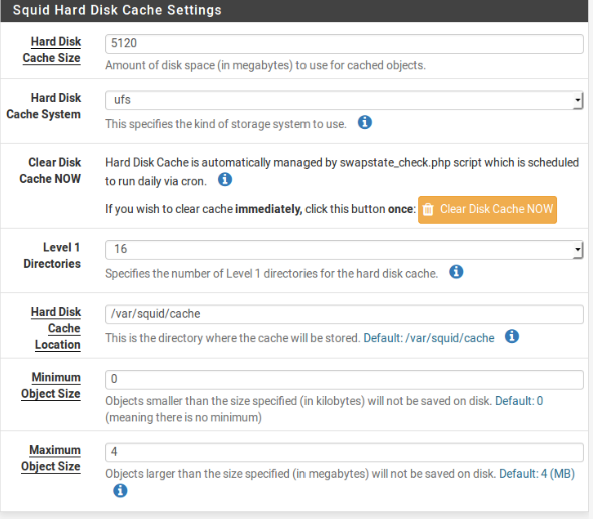

En el apartado `General` modificamos lo siguiente:

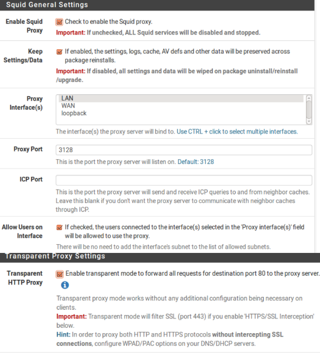

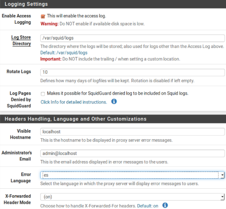

### 1.3. Status

Comprobamos en `Services`.

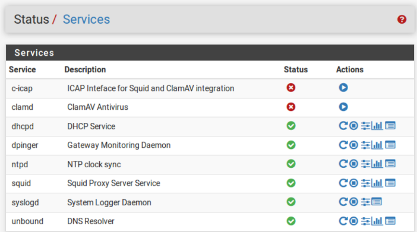

### 1.4. Certificate Manager

En el apartado `CAs` modificamos lo siguiente:

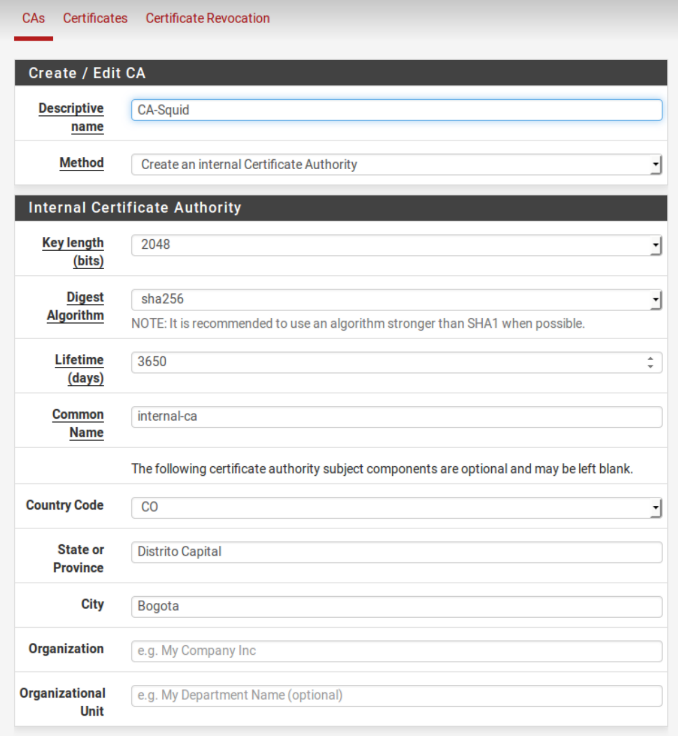

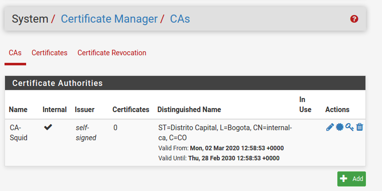

### 1.5. Squid Proxy Server

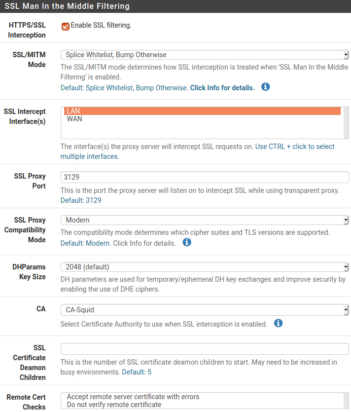

En el apartado `Antivirus` modificamos lo siguiente:

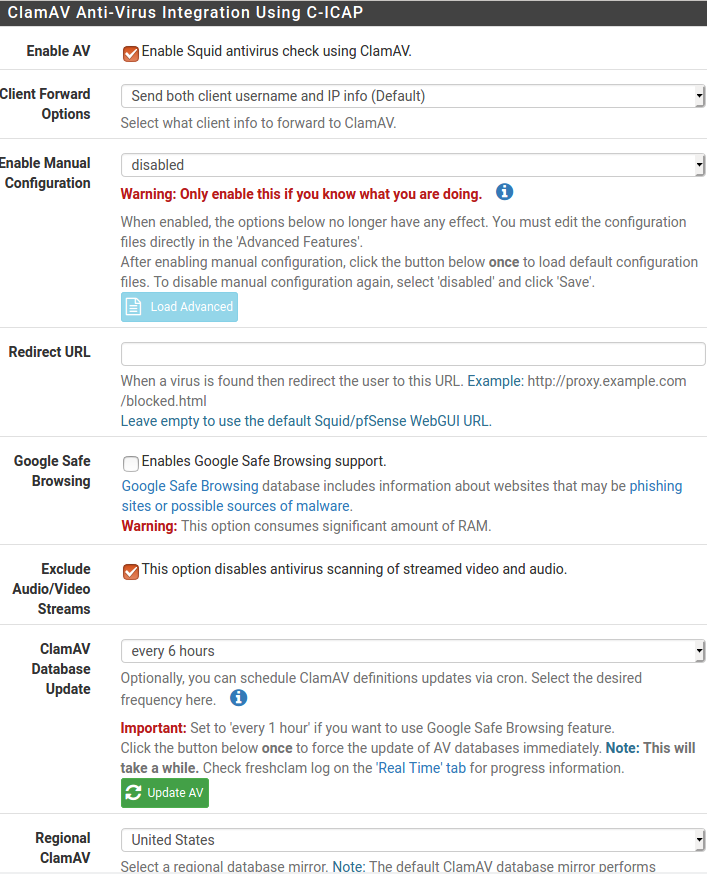

## 2. Comprobación

En el apartado `Blacklist` añadiremos alguna página web para comprobar que funciona.

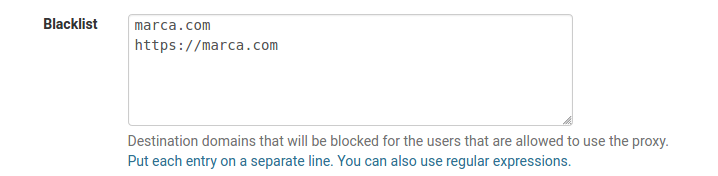

Comprobamos intentando acceder a estas páginas.

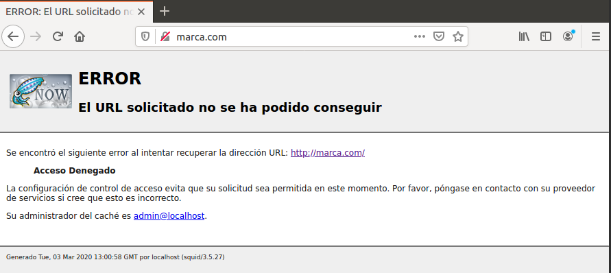

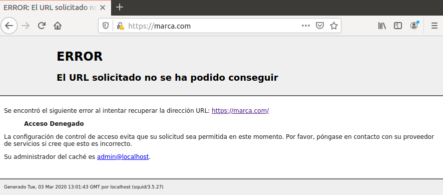
