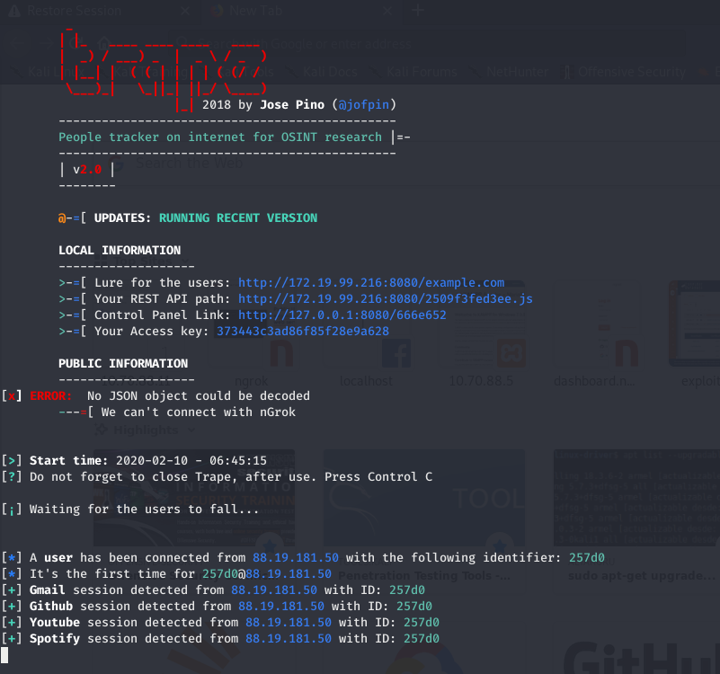
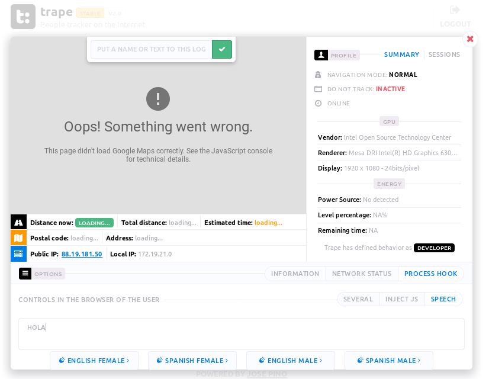

# Herramienta de análisis Trape

---

## 1. Trape

Descargamos la herramienta `trape` de su repositorio de Github:

```console
git clone https://github.com/jofpin/trape.git
```

Entramos en la carpeta que se crea y ejecutamos los siguientes comandos:

* Para evitar problemas de dependencias, instalamos los requerimientos que aparecen el archivo `requirements.txt`

```console
python2 -m pip install -r requirements.txt
```

* Ejecutamos `trape` con:

```console
python2 trape.py --url http://example.com --port 8080
```



Comprobamos que funciona con otro ordenador y entrando en la IP que nos proporciona trape:


