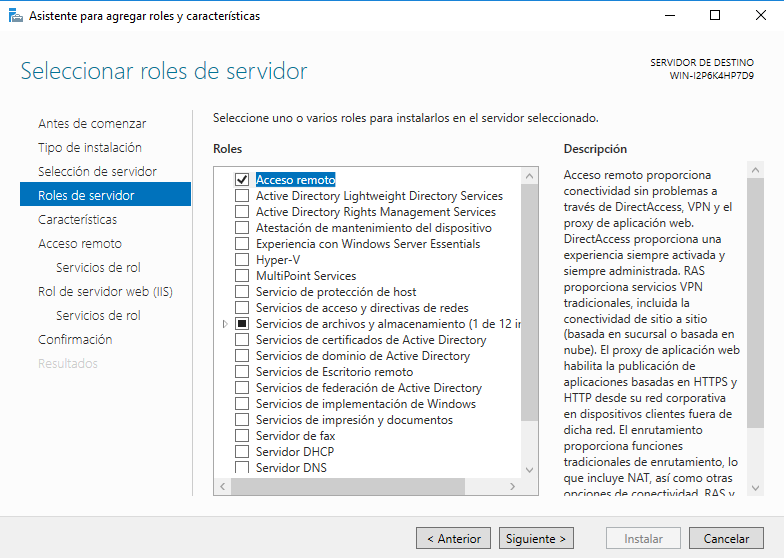
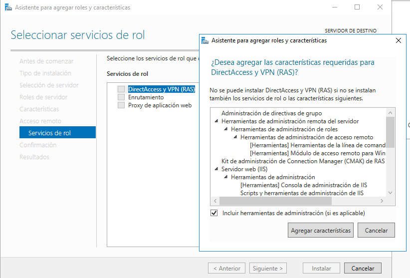
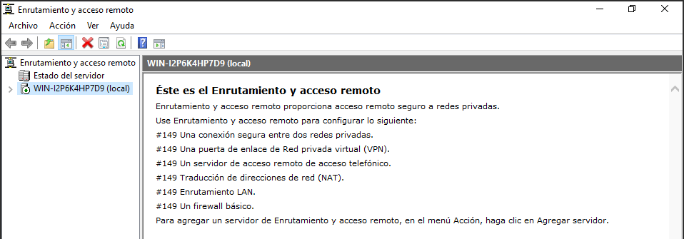
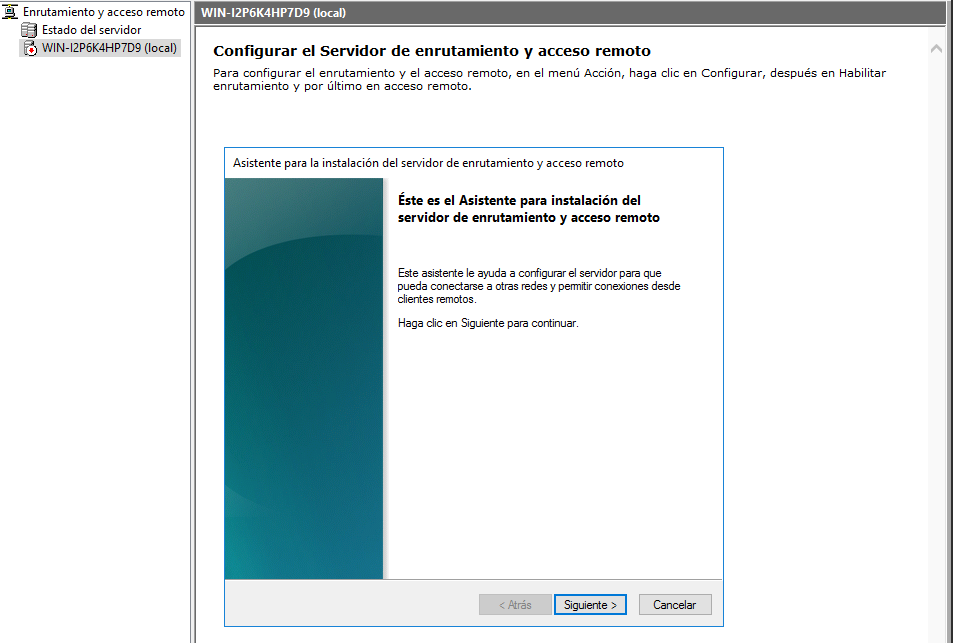
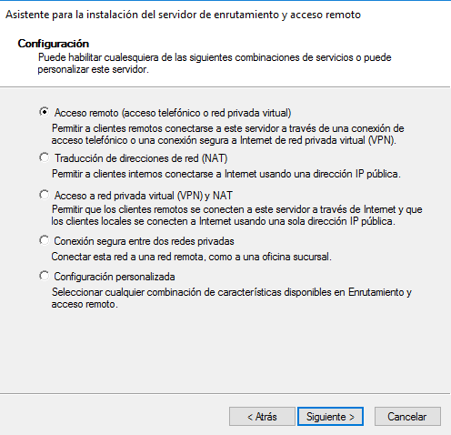
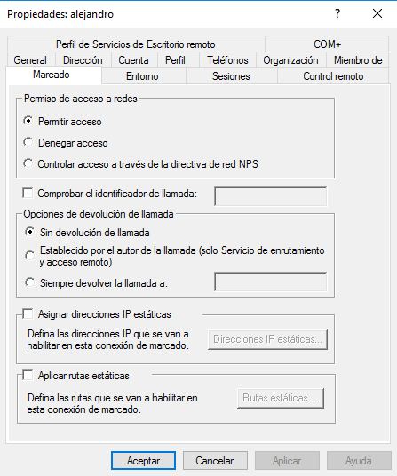
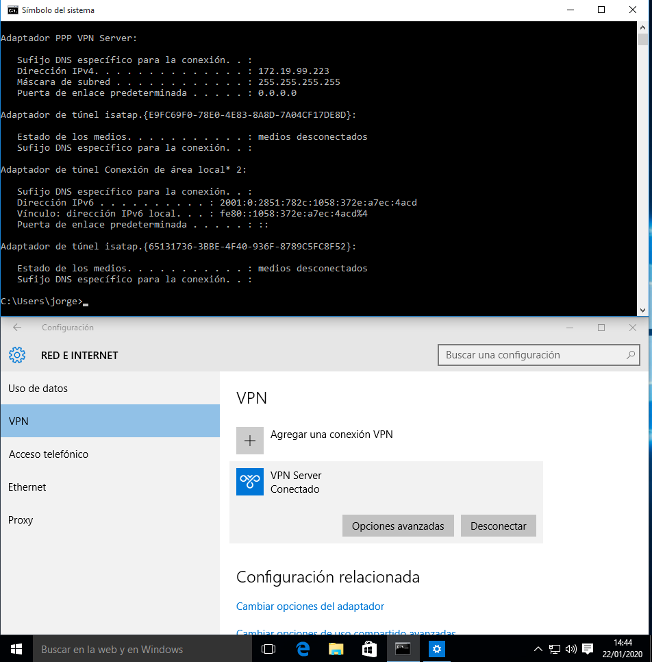
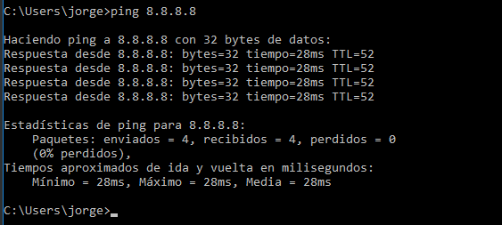

# VPN en Windows Server

---

## 1. Configuración Servidor - Windows 2016 Server

Antes que nada, ponemos la IP estática, configurada manualmente.

Ahora instalaremos `VPN` en el servidor, para ello, tenemos que ir dentro de `Administrador del servidor`:
* Administrar:
  * Agregar roles y características

* Instalamos `Acceso remoto`

Ahora configuraremos el `Enrutamiento y acceso remoto`:

Le damos a Siguiente:

Para finalizar la configuración en Windows 2016 Server, tendremos que crear un usuario de Active Directory, en mi caso **alejandro**, y le concedemos *Permitir acceso* en `Permiso de acceso a redes` en el apartado **Marcado**.

---

## 2. Comprobación Cliente - Windows10

Comprobamos que se puede conectar desde el cliente Windows 10.

Para finalizar, comprobamos que tenemos acceso a internet haciendo un `ping 8.8.8.8`

