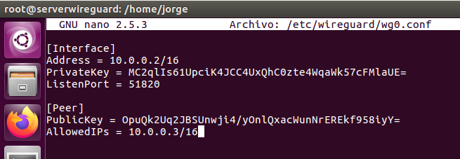
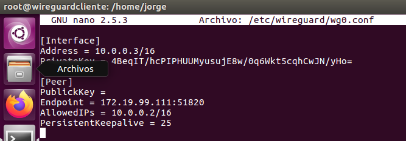
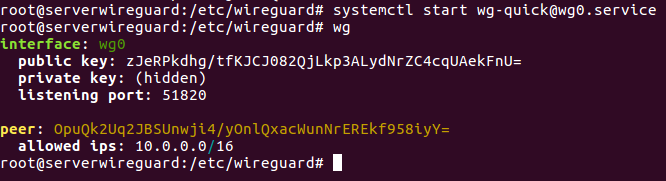
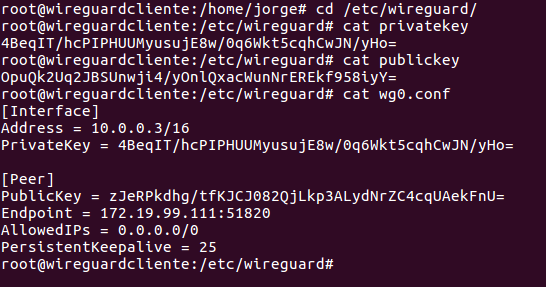
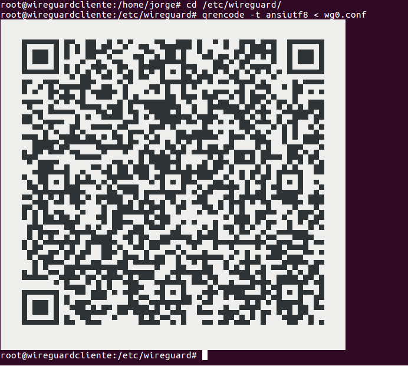

# VPN Wireguard

---

## 1. Instalación

La instalación es tan sencilla como poner el siguiente comando:

```console
sudo apt install wireguard
```

> Ubuntu inferior a la version 19.10
> ```console
> sudo add-apt-repository ppa:wireguard/wireguard
> sudo apt update
> sudo apt install wireguard
> ```

## 2. Configuración

Tanto en el cliente como en el servidor, configuramos el fichero `wg0.conf` con las respectivas claves.

**Servidor**


**Cliente**


Iniciamos el `wg-quick@wg0.service`.



Descomentamos en el servidor la siguiente línea:


## 3. Comprobación




## 4. Código QR

Para finalizar creamos el código QR y lo comprobamos con nuestro móvil.


