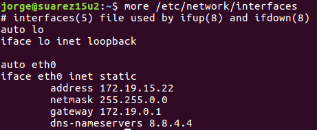
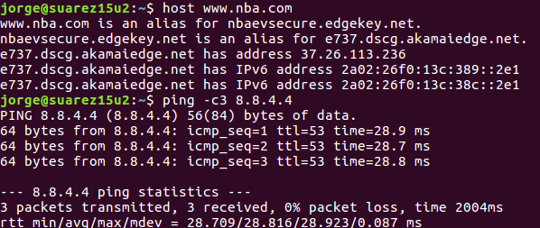
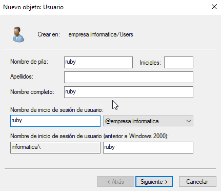

# Instalaciones y configuraciones previas

---

> ¡OJO!: Poner la red en adaptador puente en todas las máquinas.

## 1. Ubuntu 16 Cliente

### 1.1. Instalación

Empezamos instalando Ubuntu 16.

Ponemos la configuración predeterminada y seguimos con la instalación.

### 1.2. IP estática

Ahora que está instalada correctamente, configuramos la IP estática y comprobamos.

---

## 2. Ubuntu 16 Servidor

### 2.1. Instalación

Clonaremos Ubuntu 16 y después cambiaremos la MAC para que no haya problemas de compatibilidad.

### 2.2. IP estática

Ahora configuramos la IP estática.

---

## 3. Windows 7

Instalamos Windows7 con la configuración predeterminada y ponemos la IP estática.

---

## 4. Windows 2016 Server

### 4.1. Instalación

Ahora instalaremos Windows Server 2016 Standard.

### 4.2. IP estática

Configuramos la IP estática del server y comprobamos si está todo hecho correctamente.

### 4.3. Active Directory

Utilizaremos Active Directory para la creación de grupos, usuarios del dominio y unidades organizativas.

**Creación del Dominio**

Entramos en `Agregar Roles y/o características` y agregamos `Servicios de Active Directory`.
Una vez completada la instalación, marcamos `Promover Windows 2016 a Controlador de Dominio`.

* Para empezar crearemos el dominio, así que utilizaremos la opción `Agregar un nuevo bosque` con el nombre del dominio.

* El siguiente paso, es seleccionar el nivel funcional del bosque y una contraseña de *modo de restauración de servicios de directorio (DSRM)*

* Ahora se nos ha activado una opción en herramientas llamada `Usuarios y equipos de Active Directory` en la que haremos las siguientes configuraciones.

**Unidades Organizativas**

Crearemos una UO, para ello hacemos click derecho en el dominio creado -> `Nuevo` -> `Unidad Organizativa` y ponemos el nombre deseado.

**Grupos del dominio**

Ahora crearemos dos grupos dentro de la UO.
* Click derecho en la UO -> `Nuevo` -> `Grupo`

**Usuarios del dominio**

Ahora creamos varios usuarios y los incluiremos en los grupos creados anteriormente, yo lo crearé así:

Usuario  |     Grupo        |
:------: | :--------------: |
ruby     | programacion     |
python   | programacion     |
tecnico1 | servicio-tecnico |
tecnico2 | servicio-tecnico |

### 4.4. Enlazar Windows7 al dominio

Ahora utilizaremos el Windows7 y entraremos en el dominio con uno de los usuarios creados.

* Para ello entramos en nuestro usuario y en `Propiedades de Equipo` pulsamos en `Cambiar Ajustes` y ponemos el nombre del dominio y entramos con uno de los usuarios creados.

Para finalizar, reiniciamos y comprobamos que podemos entrar perfectamente con un usuario del dominio.

> ¡OJO!: Para entrar con usuario de dominio poner nombe del dominio, barra y luego nombe de usuario. Ejm:
`nombre-dominio\usuario-dominio`
