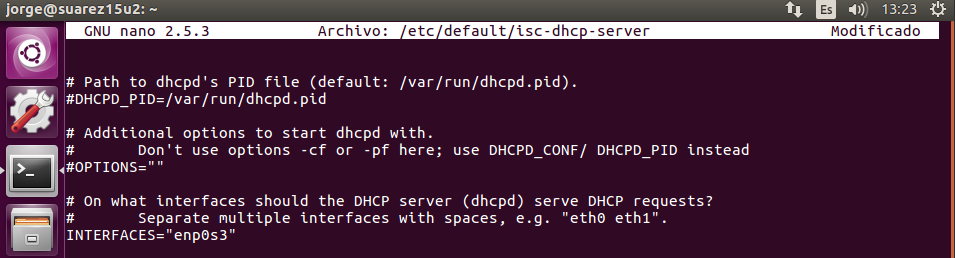

# Instalación y Configuración DHCP Linux

---

## 1. Instalación DHCP

Primero instalamos el paquete `isc-dhcp-server` mediante el gestor de paquetes `apt-get`:


---

## 2. Configuración DHCP

Ahora configuraremos la interface en el fichero `/etc/default/isc-dhcp-server` modificando la siguiente línea:

```bash
INTERFACES="enp0s3"
```



### 2.1. Copia de seguridad

Antes de editar el fichero, haremos una copia de seguridad del mismo, para prevenir errores o problemas.


### 2.2. Configuración

Ahora configuraremos el fichero con las opciones correspondientes.


---
