# Instalación y Configuración DHCP Windows

---

## Introducción

Utilizaremos dos máquinas virtuales:
* MV1: Windows2016 Server
* MV2: Windows

Antes que nada, pondremos nuestras MV's en `Red Interna`.

---

## 1. Instalación DHCP Windows 2016 Server

Para su instalacion, vamos a `Agregar roles y características` que se encuentra en el `Administrador del servidor` en el apartado `Administrar`. Tras esto, seleccionamos `Servidor DHCP` y lo instalamos.

---

## 2. Configuración del servicio DHCP

Para configurar el servicio DHCP, tendremos que acceder a la sección `DHCP` de `Herramientas` del Administrador del Servidor.

Seguidamente, definiremos un `nuevo ámbito`, para ello elegimos el botón `Nuevo Ámbito` teniendo seleccionado nuestro dominio.

* Escribimos el intervalo de direcciones que distribuye el ámbito.

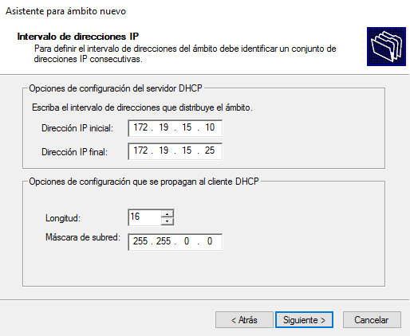

* Tras esto, marcamos el intervalo de direcciones IP qu deseemos excluir.

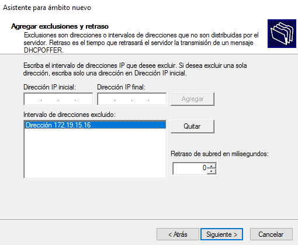

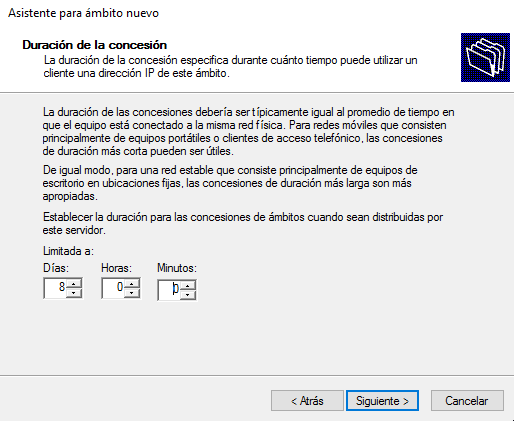

* Agregamos una dirección IP para un enrutador (Puerta enlace) usado por clientes.

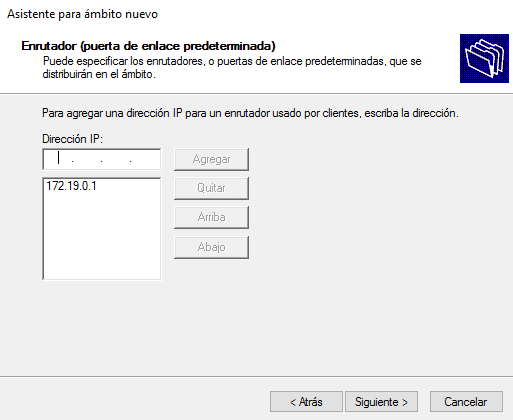

* Configurar nombre de dominio.

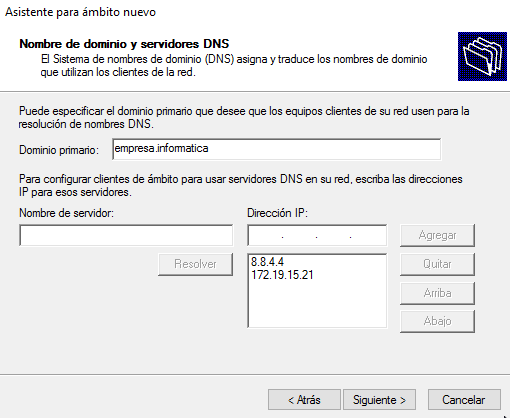

* Para finalizar activamos el ámbito.

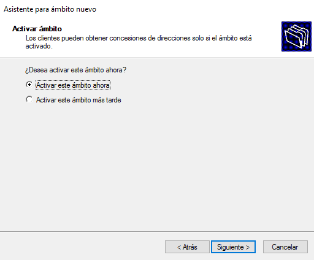

* Reservamos un cliente con la MAC.

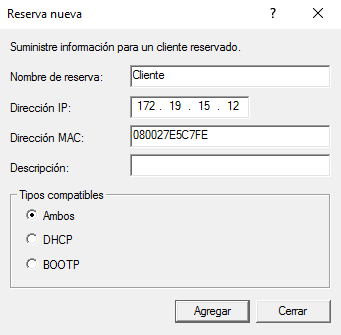

---

## 3. Comprobar funcionamiento

Ahora comprobamos que todo funciona correctamente.

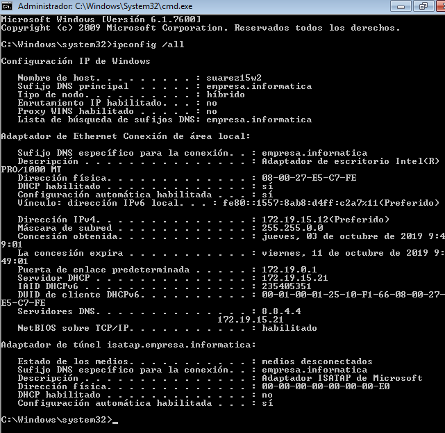

---

## 4. Crear nuevo ámbito

Ahora crearemos un nuevo ámbito compatible con el anterior.

**Primer paso**

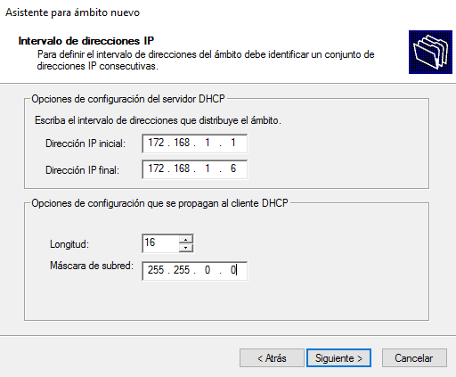

**Segundo paso**

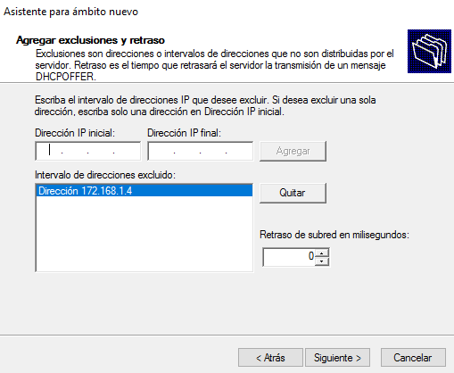

**Tercer paso**

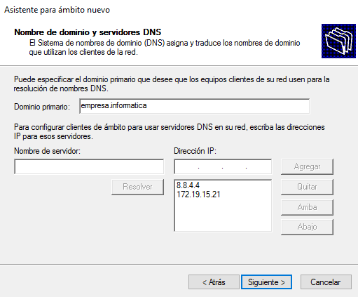

---

## 5. Superámbito

Creamos un super ámbito en el que estén los dos ámbitos incluidos y lo desactivamos para comprobar que DHCP deja de prestar servicio en ambos ámbitos.

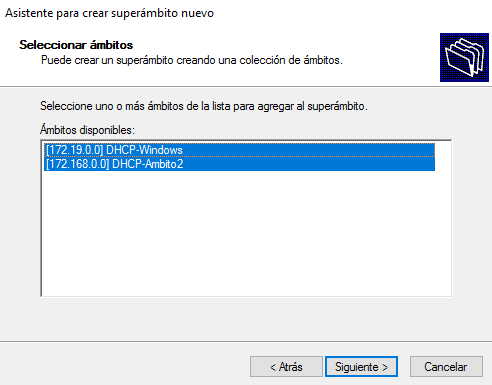

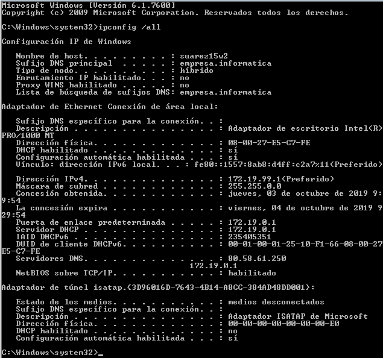
