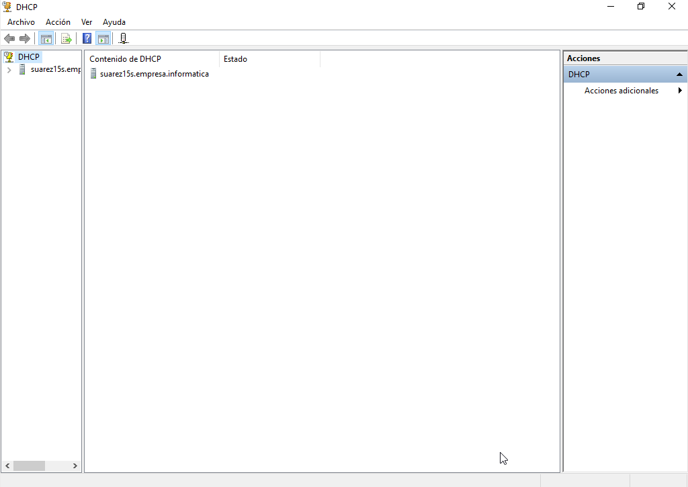

# Instalación y Configuración DHCP Windows

---

Utilizaremos dos máquinas virtuales:
* MV1: Windows2016 Server
* MV2: Windows

Antes que nada, pondremos nuestras MV's en `Red Interna`.

## 1. Instalación DHCP Windows 2016 Server

Para su instalacion, vamos a `Agregar roles y características` que se encuentra en el `Administrador del servidor` en el apartado `Administrar`. Tras esto, seleccionamos `Servidor DHCP` y lo instalamos.

---

## 2. Configuración del servicio DHCP

Para configurar el servicio DHCP, tendremos que acceder a la sección `DHCP` de `Herramientas` del Administrador del Servidor.

Seguidamente, definiremos un `nuevo ámbito`, para ello elegimos el botón `Nuevo Ámbito` teniendo seleccionado nuestro dominio.

---

## 3. Comprobar funcionamiento

