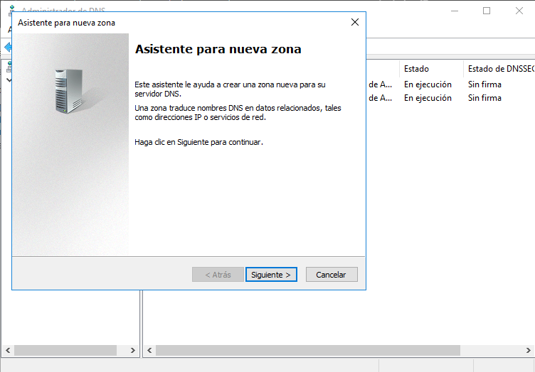
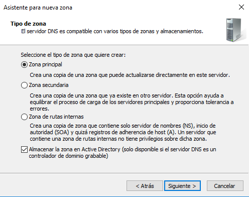
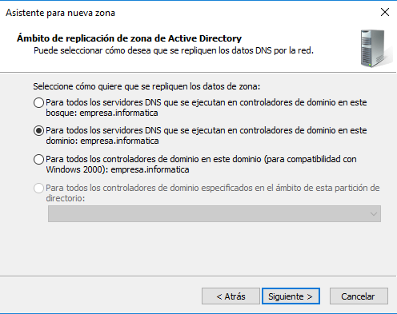
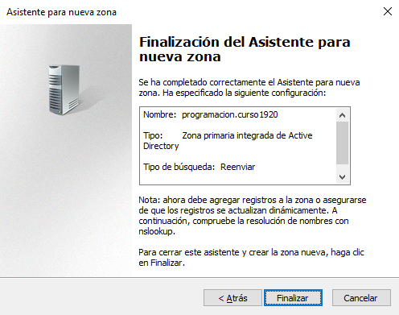
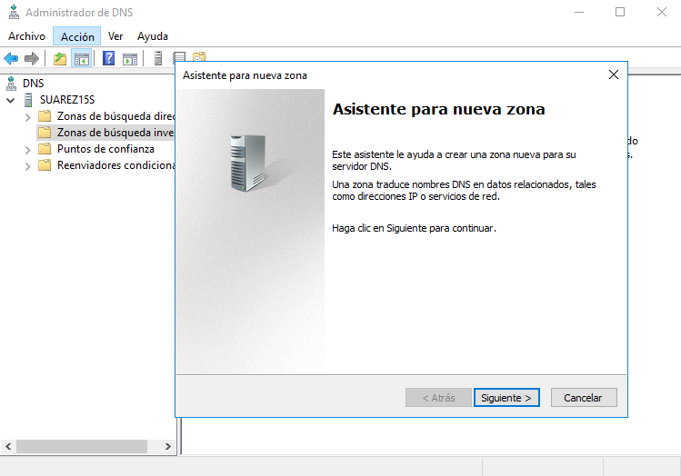
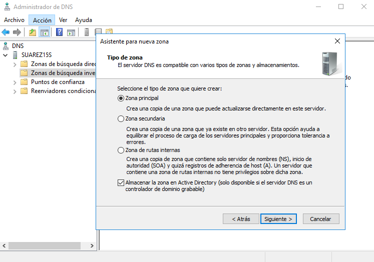
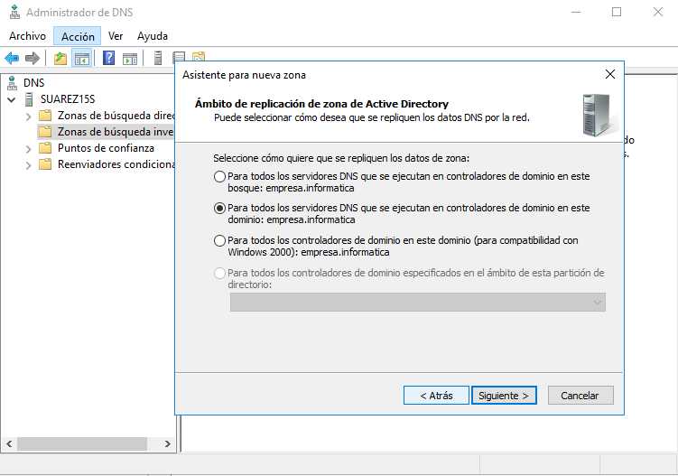
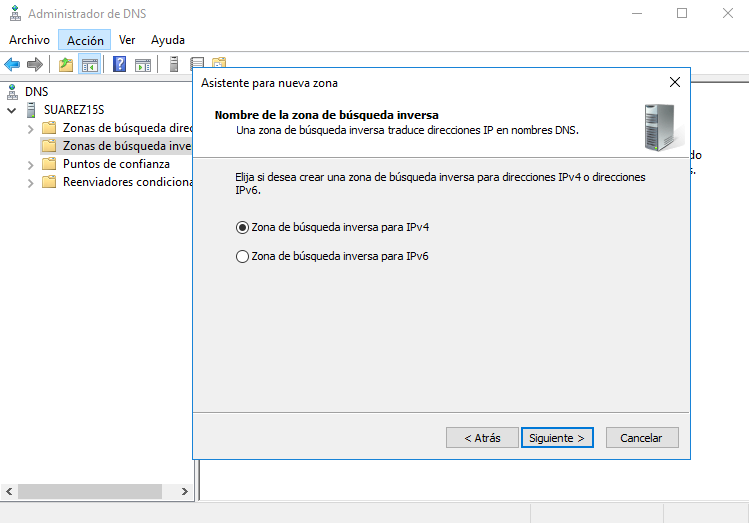
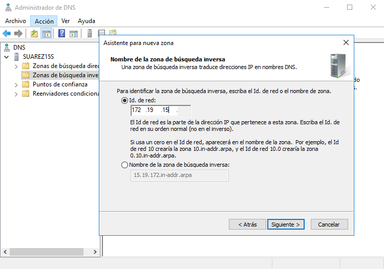
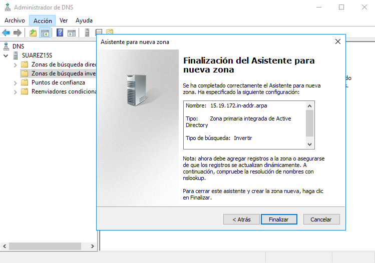

# Instalación y Configuración DNS Windows Server

---

## 1. Configuración

Vamos a crear un servidor DNS en una máquina con Windows Server 2016.

### 1.1. Zona de búsqueda directa

Empezamos haciendo una nueva `Zona de búsqueda directa` yendo al apartado DNS del Administrador del Servidor y entrando en la carpeta `Zonas de búsqueda directa`.

Seguiremos los pasos que nos proponen en la configuración y pondremos un nombre de zona (el que queramos):

* Seleccionamos `Zona Principal` y marcamos la casilla siguiente:
  * `Almacenar la zona en Active Directory`.

* Marcamos `Para todos los servidores DNS que se ejecutan en controladores de dominio en este dominio:...`.

* Comprobamos que esta todo correcto y finalizamos.

### 1.2. Zona de búsqueda inversa

Tras agregar una nueva `Zona de búsqueda directa`, añadimos una nueva `Zona de búsqueda inversa` con la siguiente configuración:

* Elegimos el tipo de `Zona Principal` y marcamos la opción `Almacenar la zona en Active Directory`.

* Seleccionamos la opción `Para todos los servidores DNS que se ejecutan en controladores de dominio en este dominio:...`.

* Elegimos en donde deseamos crear una zona de búsqueda inversa, en nuestro caso marcamos para **direcciones IPv4**

* Agregamos el *ID de Red* para identificar la zona de búsqueda inversa.

* Comprobamos que esta todo correcto y finalizamos.

### 1.3. Configurar reenviadores de DNS

## 2. Configurar el servidor para Servidor DNS Caché

## 3. Configurar servidor como DNS Maestro

## 4. Comprobación en el Servidor

## 5. Comprobación en el cliente

