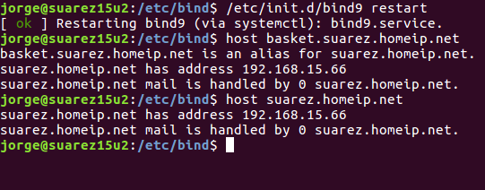
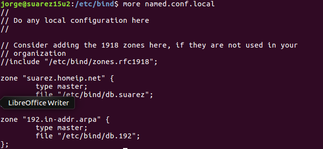

# Práctica Servidor DNS Linux bind9

---

## Introducción

`BIND` es el servidor de nombres de dominio más popular en Internet, que trabaja en todas las plataformas informáticas principales y se caracteriza por su flexibilidad y seguridad.

*Domain Name Service* (**DNS**) es el servicio que resuelve los nombres de dominio asociados a una dirección IP para direccionar las peticiones a un servidor en específico. Se utiliza cuando un nodo (o host) en Internet contacta a otro mediante el nombre de domino de la máquina y no por su dirección IP.

## Configuración

Para empezar instalaremos `BIND9` y nos desplazamos a su directorio de configuración:

~~~bash
apt install bind9
cd /etc/bind/
~~~

---

### Configurando el dominio

Editamos `named.conf.local` y añadimos la zona *suarez.homeip.net*, haciendo referencia a su fichero de configuración.

Ahora, creamos el fichero de confguración `db.suarez` copiando `db.local`.

Tras crearlo, editamos el fichero y configuramos la IP para nuestro dominio.

> Para que nuestra máquina utilice el servidor DNS que hemos creado y configurado, debemos editar el fichero `/etc/resolv.conf` y editamos la línea nameserver dejandola *nameserver 127.0.0.1*
>
>

Ahora reiniciamos el demonio `bind9` y comprobamos el correcto funcionamiento uilizando el comando host para resolver los dominios:

---

## Resolución de dominios inversa

Para disponer de resolución de dominios inversa, debemos añadir a `/etc/bind/named.conf.local`, lo siguiente:

~~~bash
zone "192.in-addr.arpa" {
  type master;
file "/etc/bind/db.192"
}
~~~

Tras añadirlo en el fichero `/etc/bind/named.conf.local`, creamos el archivo de configuración `/etc/bind/db.192` a partir de la copia del fichero `/etc/bind/db.127`.

~~~bash
cd /etc/bind
sudo cp db.127 db.192
~~~

Editamos y configuramos el fichero creado sustituyendo *localhost* por nuestro dominio (**suarez.homeip.net**):

Ahora reiniciamos el *demonio **BIND9**,* y comprobamos la resolución de dominios inversa con el comando host y la IP del dominio.

