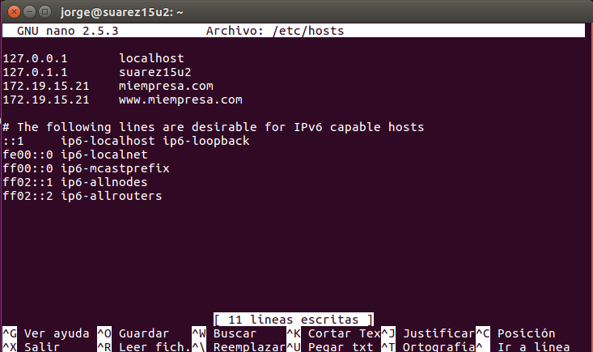
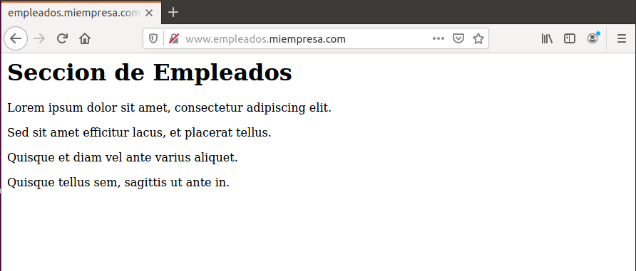

# Apache Linux

---

Práctica basada en la instalación y configuración de `Apache`, `PHP`, `MySQL`, `phpMyAdmin` y `SSL` en una MV Linux.

## 1. Configuración Apache y PHP

### 1.1. Apache

Primeramente instalaremos apache2 en nuestra máquina virtual.

> En mi caso, ya lo tenía instalado.

Para comprobar que se ha instalado correctamente, entramos en nuestro navegador y vamos a `localhost` y nos tiene que salir la siguiente página:

En el fichero `/etc/hosts` añadiremos la IP de nuestro equipo con el nombre `miempresa.com` y `www.miempresa.com`.

---

### 1.2. PHP

Ahora instalaremos `PHP`.

Para que estén confgurados correctamente tanto Apache como PHP necesitaremos instalar la librería `libapache2-mod-php`.

Tras instalarla, creamos el fichero `/var/www/html/index.php`

Comprobaremos que esta bien configurado entrando a `www.miempresa.com` en un navegador. Tiene que salirnos un recuadro con la versión de PHP instalada.

---

## 2. Virtual Hosts

Para empezar, haremos el virtualhost `www.empleados.miempresa.com`, para ello, crearemos el fichero `/etc/apache2/sites-available/empleados.conf`.

Tras esto crearemos un enlace simbólico en `/etc/apache2/sites-enabled` para activar el virtualhost.

Para finalizar la configuración, añadiremos el virtualhost al fichero `/etc/hosts` y después crearemos un index y carpeta en `/var/www` para configurar la página web de `www.empleados.miempresa.com`

**/etc/hosts**

**/var/www**

Comprobamos en nuestro navegador que funciona correctamente.

---

## 4. SSL

Cuando se instala Apache, conjuntamente se instala el `SSL`. Generaremos un certificado autofirmado ejecutando los siguientes comandos.

---

## 5. Virtual Host (Pagos)

Añadimos el fichero `pagos.conf` en los sitios activos de nuestro servicio apache.

Creamos la carpeta y fichero `/var/www/pagos/index.html`.

Añadimos el virtualhost al fichero `/etc/hosts`

---
