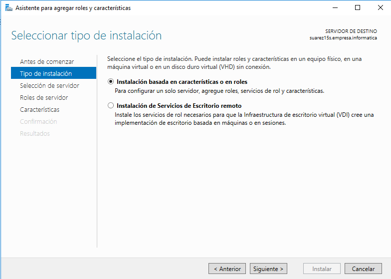
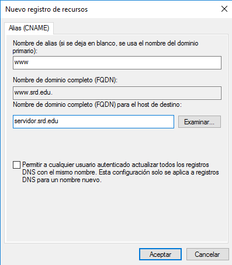
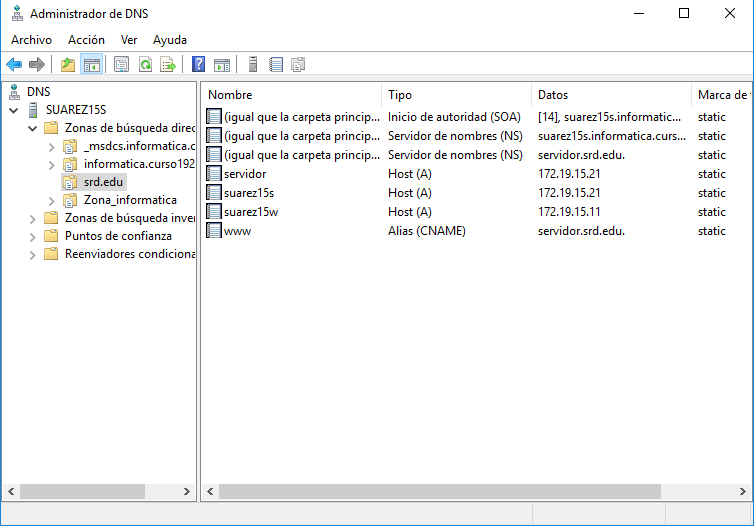
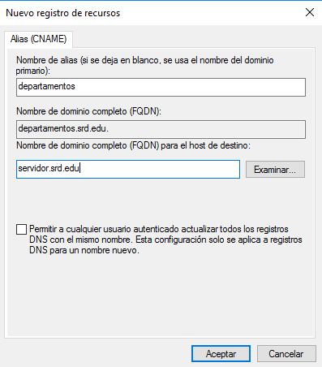
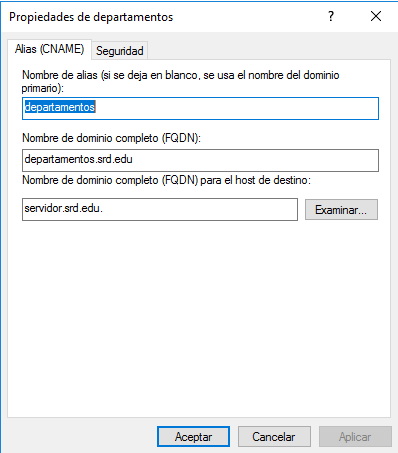
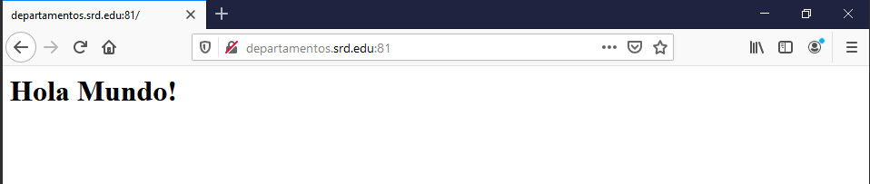

# Internet Information Server

---

## 1. Instalar, Configurar y Crear Sitios Web

Comenzaremos con instalar IIS (Internet Information Services)

### 1.1. Instalación

Para empezar, accedes a `Agregar roles y características` y comenzamos la instalación.

* Tipo de instalación:
  * Instalación basada en características o en roles.

* Selección de servidor:
  * Seleccionamos nuestro Windows Server 2016.

* Roles de servidor:
  * Seleccionamos `Servidor web (IIS)`.

* Para finalizar instalamos.

### 1.2. Comprobación

* Tras la instalación comprobamos que se puede acceder a nuestro servidor web desde `localhost`.

* Si la conexión es correcta, comprobamos desde un cliente, Windows7 en mi caso, conectándonos mediante la IP del servidor.

* Ahora tras comprobar la conexión mediante IP, probamos con los diferentes alias configurados en el servidor DNS.

### 1.2. Configuración de alias

Ahora configuraremos nuestra pagina web mediante `www.*` para ello tenemos que configurar un alias sino te saldrá un error:

Para configurarlo, vamos a la `DNS` dentro de `Herramientas`.
* Ahora, en Zonas de búsqueda directa y dentro de nuestro dominio, en mi caso *informatica.curso1920*, creamos un alias (CNAME).

* Tras configurarlo correctamente, comprobamos.

### 1.3. Creación de Sitios Web

Para la creación de sitios web tenemos que crear un `index.html` en la carpeta `C\inetpub\wwwroot` y dentro de él lo configuramos para la creación y maquetación de la web. Aparte crearemos varas subcarpetas para la creación de un pequeño sitio web con varias páginas e imágenes.

Comprobamos en el cliente Windows7 que funciona correctamente.

---

## 2. Creación de Sitios Web Independientes

### 2.1. Crear un nuevo Sitio Web

Ahora crearemos un nuevo `Sitio Web`, llamado **srd.edu** y añadimos una nueva entrada en nuestro servidor DNS de tipo ALIAS, para que la resolución `www` apunte a `servidor.srd.edu` de modo que para acceder a nuestro servidor web pueda utilizarse la resolución `www.srd.edu`.

La nueva entrada aparecerá como un alias en nuestro servidor DNS.

Ahora crearemos otro correspondiente a los departamentos.Todo con la misma configuración *excepto* el `Puerto TCP` que utilizaremos el **81**.

Para que el nuevo sitio web quede completamente operativo, debemosintroducir una nueva entrada tipo `Alias` para que la resolución `departamentos` apunte al host **servidor.srd.edu**.

### 2.2. Comprobación

Ahora comprobamos que funciona correctamente yendo a  `departamentos.srd.edu:81` en cualquier navegador.

