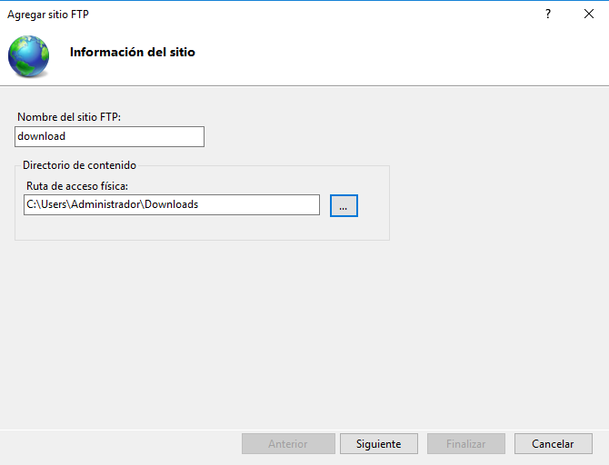
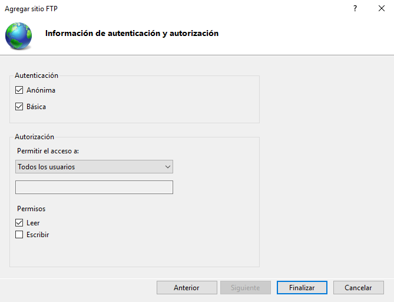

# FTP - Prácticas Windows y Linux

---

## 1. FTP - Windows

### 1.1. Instalación

Comenzaremos instalando el `servicio FTP`.

### 1.2. Sitios FTP

Crearemos tres sitios FTP con diferentes configuraciones:

Sitio FTP | Accesos anónimos | Acceso                    | Modo de acceso      | Conexión SSL                 |
:-------: | :--------------: | :-----------------------: | :-----------------: | :--------------------------: |
C         | No permitidos    | Administrador             | Lectura y escritura | NO                           |
wwwroot   | NO               | Usuarios Active Directory | Lectura y escritura | (Permitir, no requerir) SSL  |
download  | SI               | Todos                     | Consultar y leer    |                              |

> Para ejecutar cada uno de los SitiosWebs de FTP, `Detenemos` los demás e `Iniciamos` el que queremos comprobar. Esto pasa ya que tenemos la misma IP y puerto para los tres.

#### Sitio FTP -> C

**Comprobación**

#### Sitio FTP -> wwwrooot

**Comprobación**

#### Sitio FTP -> download

**Comprobación**

---

## 2. FTP - Linux (Ubuntu)

### 2.1. Instalación

Comenzaremos instalando el **servicio SSH** en el `servidor Linux`.

### 2.2. Usuarios FTP

Tras instalarse correctamente, creamos *dos usuarios* en el servidor, con diferentes privilegios y niveles de acceso al `filesystem`, en mi caso son:
* usu-ftp1
* usu-ftp2

**usu-ftp1**

**usu-ftp2**

Ahora comprobamos que se han creado correctamente las cuentas de usuario con los distintos privilegios.

### 2.3. Acceso SSH

Comenzaremos conectándonos desde el cliente con los usuarios anteriores.

Ejecutaremos una aplicación gráfica del **servidor** de forma remota desde el **cliente** mediante `ssh`.

> En mi caso ejecutaré *geany*, si lo quisieran utilizar también este programa habría que instalarlo ya que no viene predeterminado en el sistema.
> Para instalarlo por comandos, utilizaremos **sudo apt install geany**.

Comando para ejecutar la aplicación gráfica remota:
* ssh -X -p 22 usu-ftp1@172.19.15.21 geany

## 2.4. SFTP

Ahora accederemos al servidor mediante `SFTP` *(SSh File Transfer Protocol)* con los dos usuarios creados.
Buscaremos los ficheros creados en cada cuenta de usuario para descargarlos en el cliente.

Usuario   | Fichero                             |
:-------: | :---------------------------------: |
usu-ftp1  | /home/usu-ftp1/file-download-1.txt  |
usu-ftp2  | /home/usu-ftp2/file-download-2.txt  |

**usu-ftp1**

**usu-ftp2**

