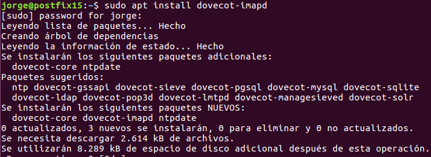

# Instalación y Configuración de un Servidor de Correo Electrónico en Linux

---

## 1. Postfix

### 1.1. Instalación

Comenzaremos instalando `Postfix` que es el servicio `SMTP en Linux` con:
* `sudo apt install postfix`.

Escogemos la instalación como `Sitio de Internet`

Creamos nuestro dominio de correo.

Y terminada la instalación comprobamos que el puerto **SMTP** esta activo y a la escucha con el comando `netstat -utap`.

### 1.2. Comprobación

Creamos dos usuarios y enviamos un correo por `telnet` para comprobar el envío y recepción de mensajes de correo.

---

## 2. Evolution

### 2.1. Instalación

### 2.2. Configuración

### 2.2. Comprobación

---

## 3. IMAP

### 3.1. Instalación

### 3.2. Comprobación

---

## 4. Squirrel

### 4.1. Instalación

### 4.2. Configuración

### 4.3. Comprobación

**Comprobando envío a `envpost`**

---

## 5. POP3

### 5.1. Instalación

---
