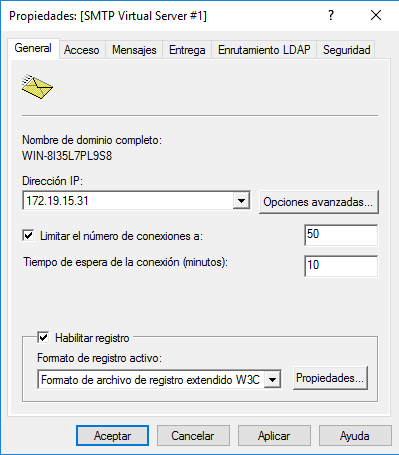

# Instalación y Configuración de Servicios de Correo Electrónico en Windows 2016 Server

---

## 1. Instalación - Servidor SMTP

En el `Administrador del servidor`, entramos en `Agregar roles y características`, una vez ahí seguimos los siguientes pasos:

**1º Paso**

**2º Paso**

**3º Paso**

**4º Paso**
Seleccionar `Servidor SMTP`.

**Último paso**

Ejecutar la instalación.

## 2. Configuración - Servidor SMTP

Ahora configuraremos el `Servidor SMTP`, para ello vamos a `Administrador de Internet Information Services (IIS) 6.0`.

Ahora vamos a `Propiedades` del `SMTP` y configuramos lo siguiente en el apartado **General**:

| Dirección IP | Limitar conexiones | Habilitar registro | Formato de registro activo |
| :----------: | :----------------: | :----------------: | :------------------------: |
| 172.19.15.31 | 50                 | SI                 |   Registro Extendido W3C   |

Después, vamos al apartado **Acceso** y configuramos la autenticación anónima y el envío de mensajes dentro de nuestra red local.

> Para hacer esto, aceptamos la conexión al servidor y la retransmisión de mensajes a todos los equipos menos a una IP, la que nosotros queramos, en mi caso `172.19.15.52`

<table>
  <tr>
    <th colspan="2">Control de conexión</th>
    <th>Control de acceso</th>
  </tr>
  <tr>
    <th>Conexión</th>
    <th>Equipo</th>
    <th>Autenticación</th>
  </tr>
  <tr>
    <td>Todo excepto la lista que aparece a continuación</td>
    <td>Un único equipo</td>
    <td rowspan="2">Acceso anónimo</td>
  </tr>
  <tr>
    <td colspan="2">Dirección IP 172.19.15.52</td>
  </tr>
</table>

##
